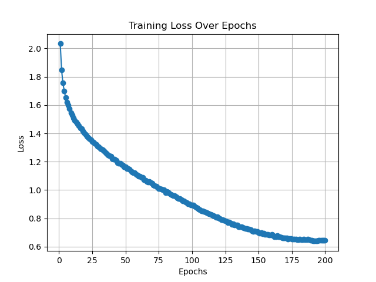

利用vibe coding方式 進行CV與VIT模型架構的練習並結合過往撰寫之功能繪製loos迭代圖與混淆矩陣

# Transformer for CIFAR-10

This repository contains a Vision Transformer (ViT) implementation for CIFAR-10 image classification.

## Training Loss Curve

## Confusion Matrix

