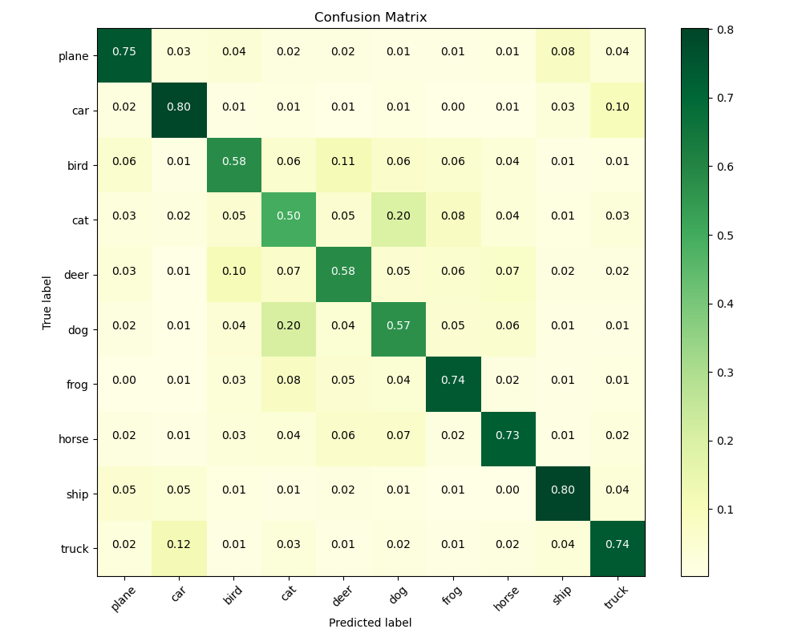
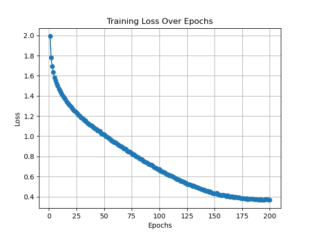

# Transformer for CIFAR-10

利用vibe coding方式 進行CV與VIT模型架構的練習並結合過往撰寫之功能繪製loos迭代圖與混淆矩陣

## Training Loss Curve

## Confusion Matrix (With Data Augmentation)

## Training Loss Curve (Without Data Augmentation)

## Confusion Matrix (Without Data Augmentation)

